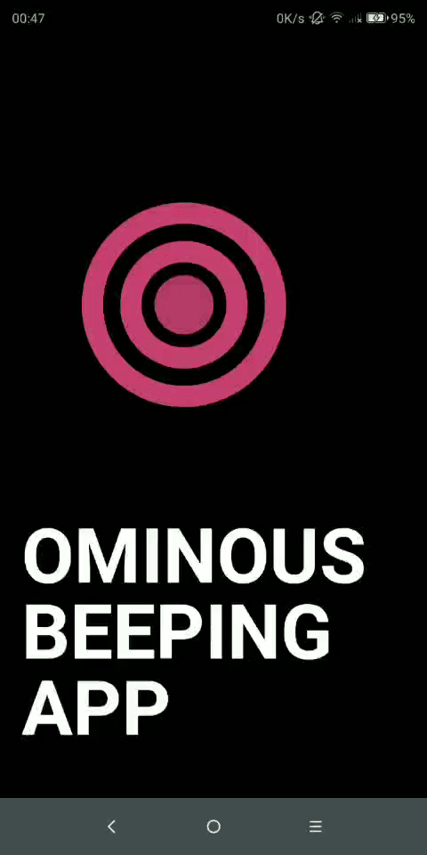

# ominous-beeping-app


## Video
- [Rick and Morty](https://www.youtube.com/watch?v=VlgZi1UHk_E)

## Sreenshoots
- 

## How to run
1. ```git clone https://github.com/yangxvlin/ominous-beeping-app.git```
2. ```cd ./ominous-beeping-app```
3. ```npm install```
4. ```npm install -g cordova```

### Android
- ```cordova run android```
    - debug: https://stackoverflow.com/a/28851952
### Web
- ```cordova run browser -- --live-reload```
### IOS